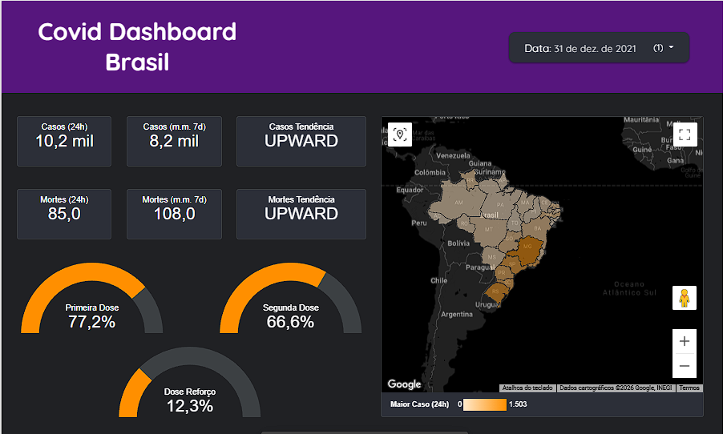
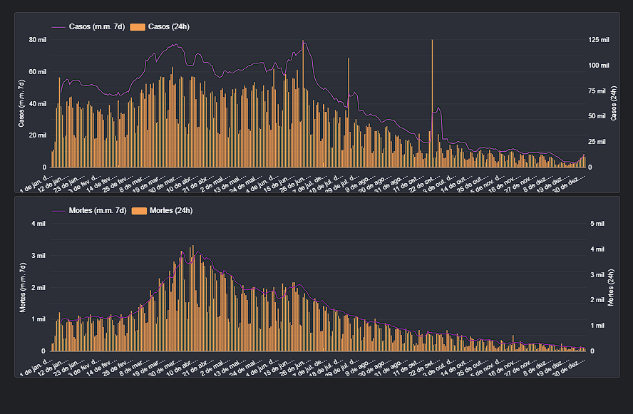
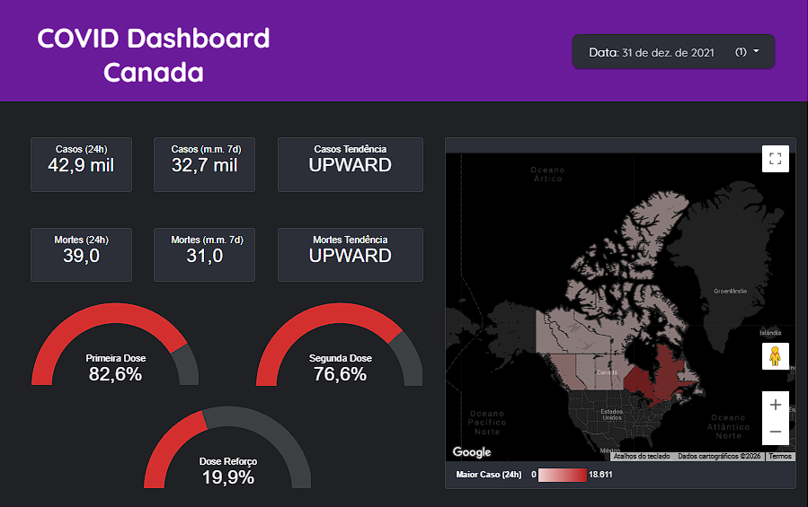
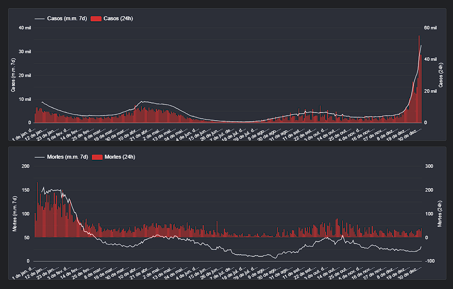

# Análise exploratória de dados usando Python, Pandas e Dashboard no Looker Studio

## Sobre o projeto
Neste trabalho foi realizada uma análise exploratória de dados com o objetivo de construir um dashboard interativo para visualizar o avanço de casos e mortes causados pelo COVID-19.

A análise também considera o andamento da vacinação no Brasil no ano de 2021 e realiza uma comparação com outro país, utilizando o Canadá como referência.

## Ferramentas utilizadas
- Python
- Pandas
- Google Colab
- Looker Studio

## Objetivo
Explorar os dados, gerar insights iniciais e apresentar as informações de forma visual por meio de um dashboard interativo.

## Dashboard Brasil

  
  

O dashboard interativo pode ser acessado aqui:

Brasil: https://lookerstudio.google.com/reporting/a850f094-3193-4c9d-ac22-c5c01c4e610e

## Dashboard Canadá

  
  

Nota: Em alguns períodos, a média móvel pode apresentar valores negativos.
Isso ocorre devido a revisões retroativas dos dados oficiais (correção de duplicatas, reclassificação de óbitos, etc.). 
Esses ajustes são comuns em bases epidemiológicas e foram mantidos no projeto para preservar a fidelidade aos dados originais.

O dashboard interativo pode ser acessado aqui:

Canadá: https://lookerstudio.google.com/reporting/8ff57034-3d23-4c79-bd3e-a7a681bbcef0

## Observação

Este projeto foi desenvolvido como parte de um exercício prático do curso de Análise de Dados da EBAC, sendo posteriormente adaptado e estruturado para portfólio.
